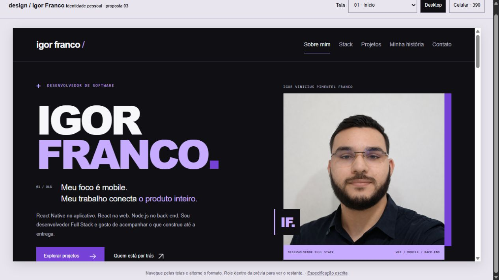

# Igor Franco | Portfólio

Portfólio pessoal de **Igor Franco**, desenvolvedor Full Stack com foco em mobile. O projeto apresenta minha trajetória, minhas competências e minha participação em produtos web e mobile, reunindo casos de trabalho, repositórios públicos e canais de contato.

A aplicação foi desenvolvida com **Next.js, React e TypeScript**, a partir de um design próprio. A identidade visual combina preto, branco, roxo e lilás, fotografia real e uma composição que prioriza leitura, contexto dos projetos e navegação direta.

[GitHub](https://github.com/igorVtermions) · [LinkedIn](https://www.linkedin.com/in/igor-vinicius-574657232) · [E-mail](mailto:igorviniciusf10@gmail.com)



_A imagem apresenta o protótipo aprovado. A moldura e os controles de revisão pertencem ao protótipo e não aparecem na aplicação._

## Índice

- [Sobre o portfólio](#sobre-o-portfólio)
- [Funcionalidades](#funcionalidades)
- [Projetos apresentados](#projetos-apresentados)
- [Tecnologias](#tecnologias)
- [Páginas e navegação](#páginas-e-navegação)
- [Executar localmente](#executar-localmente)
- [Comandos disponíveis](#comandos-disponíveis)
- [Arquitetura](#arquitetura)
- [Design system](#design-system)
- [Acessibilidade e movimento](#acessibilidade-e-movimento)
- [Testes e validação](#testes-e-validação)
- [Manutenção do conteúdo](#manutenção-do-conteúdo)
- [SEO e desempenho](#seo-e-desempenho)
- [Publicação](#publicação)
- [Documentação](#documentação)
- [Autor e contato](#autor-e-contato)

## Sobre o portfólio

O objetivo é permitir que recrutadores, clientes e outros desenvolvedores conheçam meu trabalho, entendam meu foco profissional e encontrem formas de conversar comigo.

Minha atuação conecta aplicativo, web, APIs e dados. O conteúdo apresenta desenvolvimento freelance desde 2023, formação em Análise e Desenvolvimento de Sistemas na Unopar, experiência na Thux/Mathux, colaboração na Mágicos da Limpeza e a construção do Escoply.

Os casos distinguem contexto, contribuição, tecnologias e estado atual. A fotografia é real; as composições visuais dos produtos estão identificadas como conceituais e não são capturas das interfaces atuais.

## Funcionalidades

- **Apresentação pessoal:** nome, fotografia, foco profissional e acesso aos projetos e à história completa.
- **Sobre mim na home:** trajetória e contexto profissional disponíveis na própria página inicial.
- **Stack completa:** oito grupos de tecnologias e práticas, incluindo notas sobre formação complementar e recursos em desenvolvimento.
- **Experiências profissionais:** Mágicos da Limpeza e Thux / Mathux visíveis, com cargo, período, responsabilidades e tecnologias.
- **Produto autoral:** Escoply em destaque próprio, separado dos vínculos profissionais.
- **Páginas de caso:** contexto, contribuição, tecnologias e estado de cada trabalho.
- **Código público:** explorador com seleção por teclado, detalhes técnicos, último push, README, histórico e demonstrações verificadas; seletor compacto no celular.
- **Contato direto:** e-mail, telefone, WhatsApp, GitHub e LinkedIn.
- **Cópia de e-mail:** feedback de sucesso e tratamento de falha do clipboard.
- **Menu mobile:** painel modal com navegação por teclado e atalhos para seções da home.
- **Animações:** revelações de conteúdo e respostas de interação com suporte a movimento reduzido, além da faixa automática de tecnologias.
- **Página 404:** tratamento de endereços e projetos inexistentes com retorno à home.

O formulário da home envia mensagens pelo servidor usando Resend. Telefone e WhatsApp ficam na página dedicada de contato; foram removidos da home e do footer. O escopo não inclui autenticação, banco de dados ou CMS.

## Projetos apresentados

| Trabalho               | Categoria    | Participação e contexto                                                                                     | Estado apresentado                                                       |
| ---------------------- | ------------ | ----------------------------------------------------------------------------------------------------------- | ------------------------------------------------------------------------ |
| **Escoply**            | Autoral      | SaaS web e mobile para organizar clientes, projetos, escopos, propostas, aprovações e prazos de freelancers | Em construção e testes com usuários convidados                           |
| **Mágicos da Limpeza** | Profissional | Colaboração Full Stack em aplicações para uma empresa de serviços em Portugal                               | Uso interno; atuação freelance desde janeiro de 2026, conforme currículo |
| **Thux / Mathux**      | Profissional | Experiência em produtos web, mobile e APIs, com responsabilidade direta por entregas do time mobile         | Atuação de junho de 2025 a agosto de 2026                                |

Thux/Mathux é apresentada como experiência profissional, não como um produto único. O chatbot com LLM e conceitos de RAG do Escoply é descrito como recurso em desenvolvimento.

### Repositórios públicos

| Repositório                                                       | Contexto                         | Linguagem apresentada |
| ----------------------------------------------------------------- | -------------------------------- | --------------------- |
| [escoply-web](https://github.com/igorVtermions/escoply-web)       | Frente web do produto autoral    | TypeScript            |
| [escoply-mobile](https://github.com/igorVtermions/escoply-mobile) | Frente mobile do produto autoral | TypeScript            |
| [nutritrack](https://github.com/igorVtermions/nutritrack) | MVP mobile com persistência local | TypeScript |

A home e a listagem consultam até 100 repositórios pela API pública do GitHub no servidor, com revalidação de uma hora. A seleção exibe até seis: destaque editorial primeiro, demais ordenados pelo último push. Repositórios privados, forks, arquivados, desabilitados e o README do perfil são excluídos. Trocar o projeto selecionado não faz requisições adicionais. Datas usam UTC, sem confundir push com autoria de commit ou release.

`src/content/repositories.ts` concentra a curadoria, descrições e demos verificadas em 29/09/2026. A seleção local de fallback inclui Escoply Web/Mobile, portfólio, NutriTrack, Fit Life e Ticket System, sem inventar datas ou linguagens retornadas pela API. As três demos verificadas são Escoply Web, portfólio e Ticket System. Novos links devem ser revisados antes de entrar na curadoria; o campo remoto `homepage` não é tratado automaticamente como demo. Sem JavaScript, os projetos aparecem em lista linear; o detalhe do Escoply mantém somente os links relacionados.

## Tecnologias

Versões registradas no `package.json` desta implementação:

| Tecnologia                  | Versão          | Responsabilidade                                     |
| --------------------------- | --------------- | ---------------------------------------------------- |
| Next.js                     | 16.3.6          | App Router, renderização, rotas, metadados e imagens |
| React / React DOM           | 19.3.0          | Composição da interface e interações                 |
| TypeScript                  | 6.0.3           | Tipagem estrita de componentes e conteúdo            |
| Tailwind CSS                | 4.3.3           | Pipeline CSS e tema integrado aos tokens             |
| Motion                      | 13.4.4          | Revelações e animação da lista filtrada              |
| Radix Dialog                | 1.1.23          | Comportamento acessível do menu modal                |
| Playwright                  | 1.63.0          | Testes de fluxos e responsividade no navegador       |
| Axe para Playwright         | 4.13.0          | Verificações automáticas de acessibilidade           |
| ESLint / eslint-config-next | 9.39.5 / 16.3.6 | Análise estática e regras do framework               |
| Prettier                    | 3.9.9           | Formatação de código e documentação                  |

O `package-lock.json` registra a árvore de dependências. Use `npm ci` para reproduzir a instalação. A seção “Minha stack” descreve minhas competências profissionais e de estudo; ela inclui tecnologias que não são dependências deste portfólio.

## Páginas e navegação

| Rota                           | Conteúdo                                                           |
| ------------------------------ | ------------------------------------------------------------------ |
| `/`                            | Apresentação, sobre mim, stack, trabalhos, repositórios e contatos |
| `/projetos`                    | Trabalhos e produtos: experiências, Escoply e código público       |
| `/projetos/escoply`            | Caso do produto autoral                                            |
| `/projetos/magicos-da-limpeza` | Caso da colaboração profissional                                   |
| `/experiencia/thux-mathux`     | Experiência na empresa                                             |
| `/sobre`                       | História, formação e linha do tempo                                |
| `/contato`                     | Canais de contato e cópia do e-mail                                |

A home oferece os destinos `/#sobre`, `/#stack`, `/#projetos` e `/#contatos`. A ordem das seções é a mesma visualmente e no DOM. Os links internos utilizam `next/link`; a navegação por hash também gerencia o foco no destino.

## Executar localmente

### Pré-requisitos

- Node.js compatível com a versão instalada do Next.js. O ambiente validado usa **Node.js 24.11.1**.
- npm, com o `package-lock.json` do projeto disponível.
- Microsoft Edge para executar os testes na configuração atual.

Na pasta do projeto, instale as dependências e inicie o servidor de desenvolvimento:

```sh
npm ci
npm run dev
```

Abra **http://localhost:3000**. Alterações nos arquivos da aplicação são atualizadas pelo servidor de desenvolvimento.

No PowerShell, caso a política de execução impeça o uso de `npm`, utilize `npm.cmd` nos mesmos comandos.

### Build de produção

```sh
npm run build
npm start
```

`npm start` exige um build gerado previamente. Para ativar o envio de mensagens, copie `.env.example` para `.env.local` e configure `RESEND_API_KEY` e `CONTACT_FROM_EMAIL`, usando um remetente de domínio verificado no Resend. Na hospedagem, configure os mesmos valores como segredos do servidor. Nunca use o prefixo `NEXT_PUBLIC_` para a chave.

O destinatário vem de `src/content/profile.ts`; o e-mail do visitante é usado como `reply_to`. Sem configuração, a API retorna indisponibilidade e o formulário preserva a mensagem. A confirmação só aparece quando o provedor aceita o envio; isso não garante entrega na caixa de entrada. Há validação no servidor, honeypot e limite de cinco tentativas por dez minutos por IP. O limite é local ao processo: em múltiplas instâncias, deve ser substituído por armazenamento compartilhado ou regra de proteção na hospedagem. O proxy de produção deve sobrescrever `x-forwarded-for`.

## Comandos disponíveis

| Comando                          | O que faz                                                        |
| -------------------------------- | ---------------------------------------------------------------- |
| `npm run dev`                    | Inicia o Next.js em desenvolvimento                              |
| `npm run build`                  | Gera e valida o build de produção                                |
| `npm start`                      | Serve o build de produção                                        |
| `npm run typecheck`              | Verifica os tipos sem emitir JavaScript                          |
| `npm run lint`                   | Analisa a aplicação, os testes e a configuração Playwright       |
| `npm test`                       | Executa os testes de navegador                                   |
| `npm run format`                 | Formata os arquivos abrangidos pelo script com Prettier          |
| `node scripts/visual-review.mjs` | Gera capturas e métricas locais com o servidor de produção ativo |

## Arquitetura

```text
src/
  app/                     Rotas, layout, metadados e estilos globais
    projetos/[slug]/       Páginas de caso por slug
    experiencia/           Experiência profissional
    sobre/                 História e formação
    contato/               Canais de contato
  components/
    ui/                    Primitivos, ícones e retrato
    layout/                Cabeçalho, rodapé, menu e foco de hash
    home/                  Seções da página inicial
    projects/              Produto autoral e página de caso
    experience/            Experiências, períodos e páginas de atuação
    about/                 Linha do tempo
    contact/               Contato direto, redes e clipboard
    motion/                Provedor e wrappers de animação
  content/                 Dados tipados e compartilhados
  styles/                  Tokens e estilos organizados por domínio
  lib/                     Parâmetros compartilhados de movimento
public/
  images/                  Retrato real usado pela aplicação
  icons/                   Família SVG aprovada
tests/                     Testes de comportamento e acessibilidade
scripts/                   Automação da revisão visual
docs/                      Design system, decisões e validação
outputs/                   Protótipo e referências de design
work/                      Materiais de trabalho e extrações locais
```

### Componentização e responsabilidade

As páginas compõem seções e definem metadados. Os dados ficam em módulos de conteúdo, os componentes de domínio organizam a apresentação e os primitivos compartilham contratos visuais e semânticos.

**Server Components são o padrão.** Menu, clipboard, foco de hash e wrappers de movimento delimitam as partes que precisam de JavaScript no navegador. Experiências e produto autoral são conteúdo de servidor, sem carrossel ou filtros.

Estado local é mantido perto da interação, sem gerenciador global. Experiências e produtos possuem tipos próprios; slugs inválidos são tratados com `notFound()`.

### Práticas adotadas

- TypeScript em modo estrito.
- Dados de contato centralizados, sem repetição de números e endereços em cada página.
- Modelo de projeto compartilhado entre home, listagem e detalhes.
- Links para navegação e botões para ações, sem controles interativos aninhados.
- Arquivos divididos por responsabilidade e estilos separados por domínio.
- Tokens compartilhados para cores, espaçamento, tipografia e movimento.
- Limpeza de listeners e timers nas interações que os utilizam.
- Estados de falha explícitos para o clipboard.
- Dependências com versões exatas e sem motores de animação redundantes.

## Design system

O design é regido pela [especificação do portfólio](ESPECIFICACAO_PORTFOLIO.md). A referência visual é [outputs/design.html](outputs/design.html), e os contratos dos componentes estão no [catálogo do design system](docs/design-system.md).

### Identidade visual

| Token         | Cor       | Uso                       |
| ------------- | --------- | ------------------------- |
| `background`  | `#101014` | Fundo principal           |
| `foreground`  | `#F7F7FA` | Texto principal           |
| `accent`      | `#7541D6` | Ações primárias e moldura |
| `accent-soft` | `#C6ABFF` | Destaques e foco          |
| `muted`       | `#B8B6C2` | Texto secundário          |
| `border`      | `#3C3946` | Separadores               |
| `surface`     | `#1B1822` | Superfícies secundárias   |

Os demais tokens, incluindo etiquetas, camadas e movimento, ficam em [src/styles/tokens.css](src/styles/tokens.css). O tema Tailwind referencia esses valores. Arial/Helvetica são usadas em títulos e corpo; Consolas é usada em índices e metadados.

### Responsividade

- Contêiner máximo de **1320 px**.
- Margens laterais de **60 px** no desktop e **24 px** no celular.
- Layout mobile até **700 px**.
- Composição intermediária de **701 a 900 px**.
- Revisão nas larguras de **320, 360, 390, 768, 1024 e 1440 px**.

No celular, texto e ações precedem o retrato; stack e projetos passam para uma coluna. A ordem de leitura não depende de `order` no CSS. A família de 12 ícones mantém traço de 1,6 px e cor por `currentColor`.

## Acessibilidade e movimento

O projeto inclui skip link, landmarks semânticos, um H1 por página, foco visível e texto alternativo para a fotografia. Ícones decorativos são ocultos de leitores de tela, e etiquetas de tecnologia não são controles interativos.

O menu utiliza Radix Dialog para contenção e restauração de foco, fechamento por Escape e interação com o backdrop. Também fecha ao mudar para desktop e permite rolagem interna em telas baixas.

Experiências apresentam datas estruturadas em elementos `time` e contribuições em listas. O conteúdo essencial permanece visível. O clipboard anuncia sucesso ou falha em uma região de status.

As animações usam Motion e CSS, com parâmetros compartilhados em [motion-tokens.ts](src/lib/motion-tokens.ts). O hook `useMotionPreference` usa um snapshot estável para servidor e hidratação. A faixa de tecnologias inicia automaticamente e suspende a reprodução fora da tela ou com a aba oculta. Experiências ficam sempre visíveis, com entrada suave e sem troca automática. Links de seção na página atual usam rolagem animada entre 650 e 1.200 ms, com desaceleração e cancelamento por interação manual. O conteúdo principal permanece legível sem JavaScript.

A demonstração de contato digita código ilustrativo, aciona Run e monta uma landing page com a identidade de Igor. O visitante pode antecipar a execução, pausar ou repetir; o resultado permanece visível com um CTA que leva ao primeiro campo vazio do formulário. O preenchimento pausa a sequência, e repetir nunca apaga os dados. A reprodução também suspende fora da viewport e com aba oculta. Com movimento reduzido, a prévia é estática e oferece reprodução opcional. Sem JavaScript, a prévia e o link para contato continuam disponíveis. Não há execução real do trecho de código nem envio automático de e-mail.

## Testes e validação

Para validar uma alteração:

```sh
npm run typecheck
npm run lint
npm run build
npm test
```

A configuração Playwright usa `http://127.0.0.1:3100`, dois workers e Microsoft Edge (`channel: "msedge"`). Os testes iniciam um servidor de produção isolado, sem reutilizar o servidor de desenvolvimento. Os testes de sucesso e falha do formulário simulam o provedor no navegador e não enviam e-mails reais.

**Configuração fora do Windows:** o comando de servidor em `playwright.config.ts` usa `npm.cmd`. Em Linux ou macOS, ajuste para `npm run start -- --hostname 127.0.0.1`. Se optar pelo Chromium do Playwright, remova `channel: "msedge"` e instale o navegador com `npx playwright install chromium`. O script de revisão visual também seleciona Edge explicitamente.

### Cobertura dos fluxos

- Acesso direto às sete rotas, títulos e H1 único.
- Ordem da home, oito categorias de stack e contatos agrupados.
- Separação entre experiências e produto autoral, períodos e páginas de atuação.
- Menu com teclado, Escape, botão, backdrop e mudança de viewport.
- Navegação para hashes dentro e fora da home.
- Sucesso e falha na cópia do e-mail.
- Resposta HTTP 404 para projeto inexistente.
- Ausência de overflow horizontal nas seis larguras previstas.
- Movimento reduzido e conteúdo principal sem JavaScript.
- Menu em tela baixa e reflow com ampliação CSS de 200%.
- Análise automática Axe nas páginas e no menu.

O [registro de verificação de 28/09/2026](docs/verification.md) documenta **16 testes aprovados**, build, typecheck e lint concluídos, além da revisão visual. Esse registro corresponde à versão verificada; execute novamente os comandos após alterações relevantes.

### Capturas e métricas locais

Com o build de produção rodando em `127.0.0.1:3000`, execute em outro terminal:

```sh
node scripts/visual-review.mjs
```

As capturas e o arquivo `lab-metrics.json` são gravados em `docs/qa/`, pasta gerada e ignorada pelo Git. As medições locais não equivalem a Core Web Vitals de usuários em produção. A análise automática de acessibilidade também não substitui revisão manual com leitor de tela, dispositivos físicos e outros navegadores.

## Manutenção do conteúdo

| Alteração                                           | Arquivo                                                    |
| --------------------------------------------------- | ---------------------------------------------------------- |
| Nome, apresentação, biografia, contatos e navegação | [src/content/profile.ts](src/content/profile.ts)           |
| Categorias, tecnologias e notas da stack            | [src/content/stack.ts](src/content/stack.ts)               |
| Produto autoral, status e tecnologias               | [src/content/projects.ts](src/content/projects.ts)         |
| Empresas, períodos, cargos e contribuições          | [src/content/experiences.ts](src/content/experiences.ts)   |
| Repositórios públicos                               | [src/content/repositories.ts](src/content/repositories.ts) |
| Formação e linha do tempo                           | [src/content/timeline.ts](src/content/timeline.ts)         |
| Tokens de identidade visual                         | [src/styles/tokens.css](src/styles/tokens.css)             |
| Tempos e parâmetros de animação em React            | [src/lib/motion-tokens.ts](src/lib/motion-tokens.ts)       |

Ao adicionar um caso, mantenha slug e endereço coerentes e revise a listagem, a rota de detalhe e os testes. Experiências profissionais ficam em `experiences.ts`, com datas `YYYY-MM` e fim `null` para atuação atual. A home e a listagem apresentam a atuação atual primeiro; a trajetória ordena os vínculos pela data inicial. O Escoply é referenciado pelo nome em `projects.ts`, sem depender da posição no array.

O retrato fica em `public/images/igor-franco.jpeg`. Sua apresentação, enquadramento e carregamento são definidos pelo componente `Portrait`. Composições conceituais devem continuar identificadas até serem substituídas por capturas reais autorizadas. O currículo não faz parte dos arquivos públicos da aplicação.

### Arquivos gerados

O `.gitignore` exclui dependências, build, caches, resultados de testes, capturas de QA, logs, variáveis de ambiente e extrações temporárias do protótipo. Código, documentação, assets da aplicação e lockfile devem permanecer versionados. `next-env.d.ts` é gerado pelo Next.js e não precisa ser editado manualmente.

## SEO e desempenho

- Metadados no layout e nas páginas, com título e descrição por rota.
- Idioma do documento configurado como `pt-BR`.
- Open Graph básico e dados estruturados `Person` com informações reais.
- Casos conhecidos pré-renderizados por `generateStaticParams`.
- Fotografia entregue por `next/image`, com dimensões, `sizes` e preload quando acima da dobra.
- Fontes de sistema, sem download de famílias tipográficas externas.
- Conteúdo editorial local e repositórios do GitHub com cache no servidor.
- Conteúdo inicial legível antes da hidratação.

O domínio de produção ainda não está configurado. Canonical, sitemap e regras de robots devem ser definidos quando o endereço real estiver disponível. Não há URL fictícia de produção no projeto.

## Publicação

O projeto pode ser executado em uma hospedagem compatível com Next.js e Node.js. A configuração atual usa build e servidor Next.js, sem exportação estática configurada.

Fluxo básico no ambiente de destino:

```sh
npm ci
npm run build
npm start
```

Na hospedagem, configure a versão do Node.js, o comando de build e a execução do servidor conforme o ambiente. Depois de definir o domínio, ajuste os metadados associados ao endereço público e verifique rotas, imagens, links de contato e HTTPS.

**Estado desta entrega:** aplicação implementada e validada localmente; publicação pública e domínio ainda não configurados.

## Documentação

| Documento                                                     | Finalidade                                                |
| ------------------------------------------------------------- | --------------------------------------------------------- |
| [Especificação do portfólio](ESPECIFICACAO_PORTFOLIO.md)      | Regras de produto, conteúdo, design e desenvolvimento     |
| [Protótipo navegável](outputs/design.html)                    | Referência visual aprovada; abrir localmente no navegador |
| [Documentação do design](outputs/design.md)                   | Contexto complementar da proposta                         |
| [Design system](docs/design-system.md)                        | Tokens, componentes, contratos e estados                  |
| [Decisões de implementação](docs/implementation-decisions.md) | Escolhas técnicas e adaptações documentadas               |
| [Dependências e origens](docs/third-party-components.md)      | Bibliotecas, versões, licenças e referências              |
| [Verificação](docs/verification.md)                           | Resultados registrados e limitações da validação          |

## Autor e contato

**Igor Vinicius Pimentel Franco**  
Desenvolvedor Full Stack com foco em mobile.

- **E-mail:** [igorviniciusf10@gmail.com](mailto:igorviniciusf10@gmail.com)
- **Telefone:** [(21) 97488-5166](tel:+5521974885166)
- **WhatsApp:** [Iniciar conversa](https://wa.me/5521974885166)
- **GitHub:** [igorVtermions](https://github.com/igorVtermions)
- **LinkedIn:** [Igor Vinicius](https://www.linkedin.com/in/igor-vinicius-574657232)
